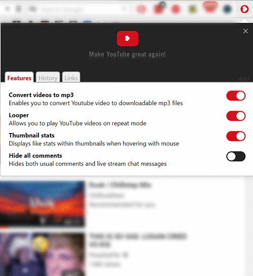
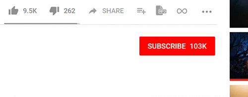
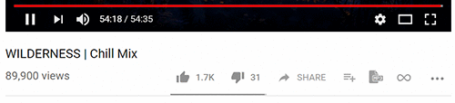
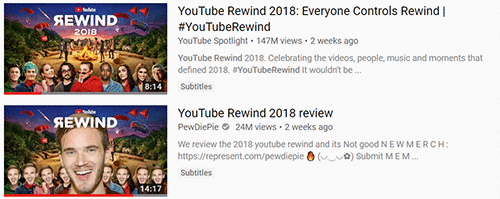
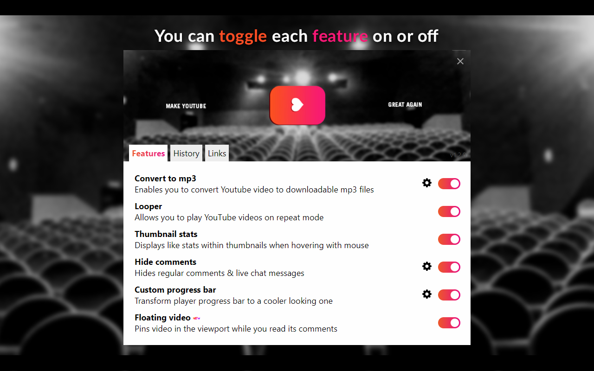
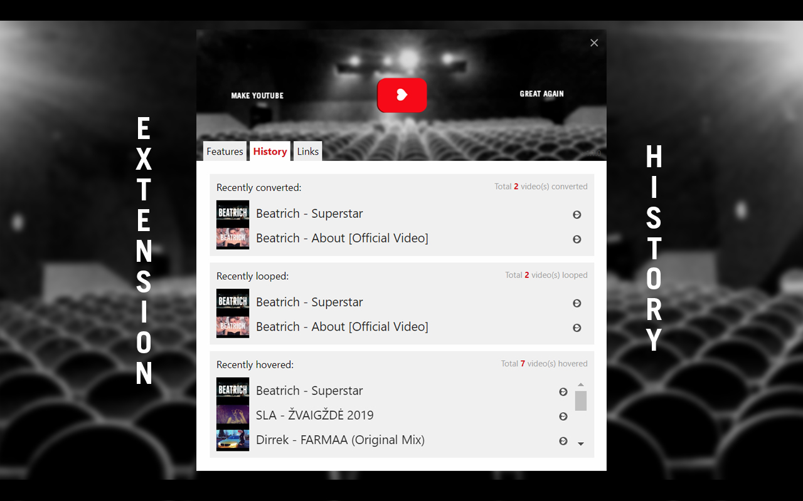
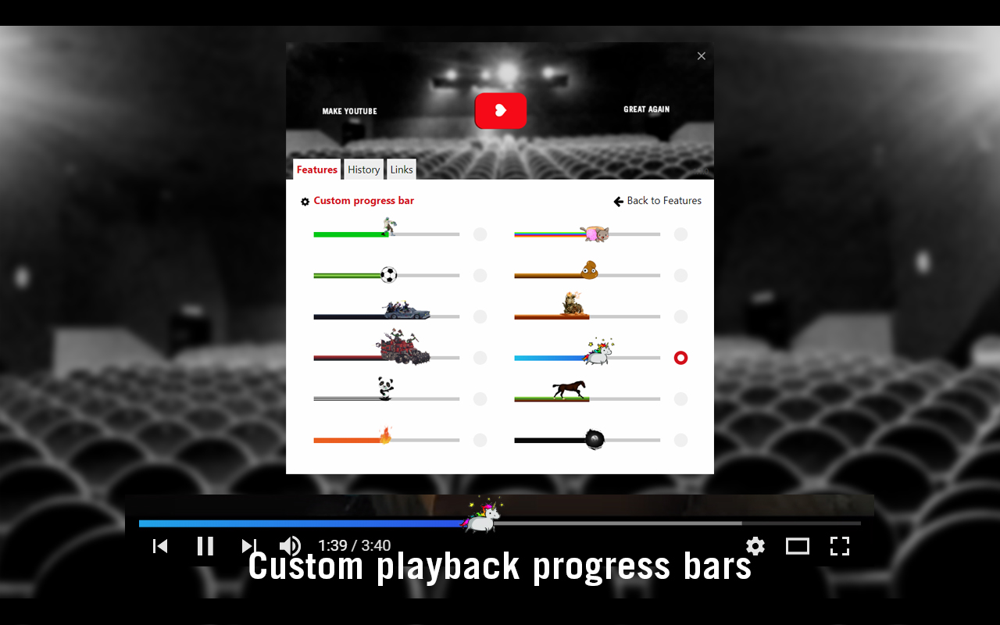
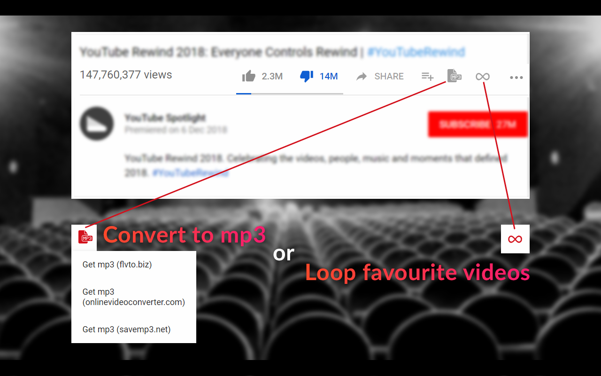
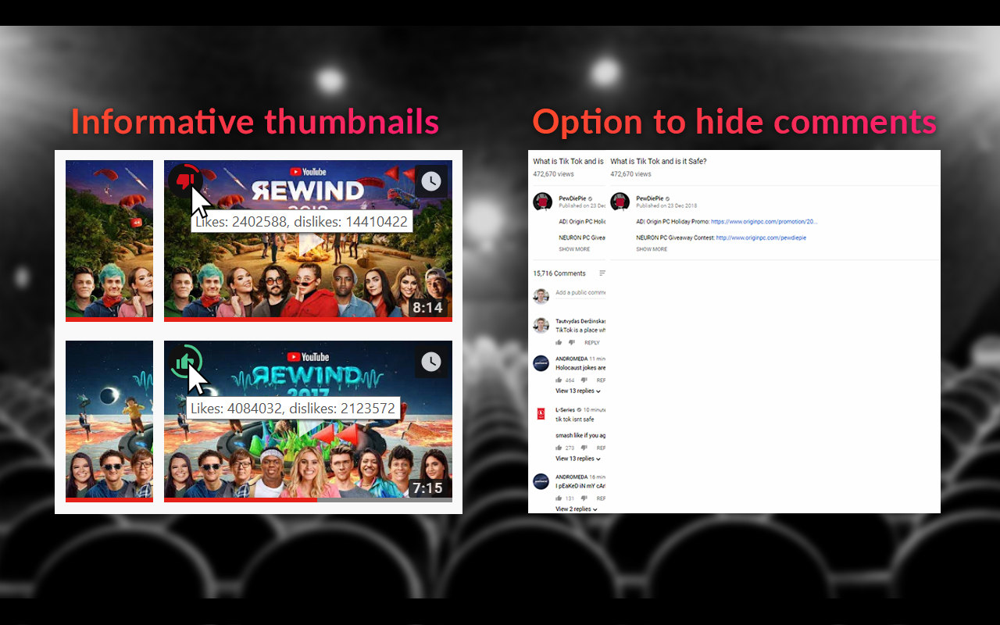

  

  
  
  
  
  

## Table of content
- [About](#about)
- [Installation](#installation)
- [Features](#features)
- [Screenshots](#screenshots)
- [Road map](#road-map)
- [Development](#development)
- [License](#license)

## About
_First of all please have in mind that extension name "Make YouTube great again" is chosen only because it sounds funny! Please don't look for any hidden political message - there is none._

Make YouTube Great Again is a Chrome extension which extends YouTube websites user interface with additional [features](#features). User don't have to use all of the extensions features as there is an option to toggle each of them on and off. There is also a history tab which shows how many times and on what YouTube videos those features been used.

## Installation
Currently you can only use this extension with Google Chrome web browser.
To install it please visit a Chrome web store page by clicking image below:

## Features

  <strong>Convert videos to mp3</strong>
  

  
  

Adds button under each YouTube video which provides an option to convert it to downloadable mp3 file.
It's users responsibility to use this feature only on videos which have free, non-copyrighted soundtracks.

____

  <strong>Loop videos</strong>
  

  
  

Adds button under each YouTube video which when activated enables video looping.
This works fine with both new HTML5 player and legacy flash player.

____

  <strong>Preview like stats on video thumbnails</strong>
  

  
  

Allows user to see how many times video was liked/disliked before getting to actual video clip page.
Once user hovers video thumbnail it adds a like/dislike indicator.

____

  <strong>Hide comments</strong>
  

  
  

Sometimes it's nice to hide the comments... This feature does exactly that.
It hides both normal comments and live chat messages.

## Screenshots

## Road map
* Port extension to browsers such as Firefox and Opera
* Add more features

## Development
Everyone is welcomed to contribute to the project or use the code for their own projects

To contribute you need to perform these steps:
1. Run `npm install` to install npm dependencies
2. Apply your changes and modifications
3. Run `npm run lint` to make sure code is well formatted
4. Run `npm run build` to compile the code and generate extension source folder
5. In your browser extensions window enable development mode and load MYGA extension from folder `extension` to test your changes

## License
The repository code is open-sourced software licensed under the [MIT license](https://github.com/SlimDogs/make-youtube-great-again/blob/master/LICENSE?raw=true).