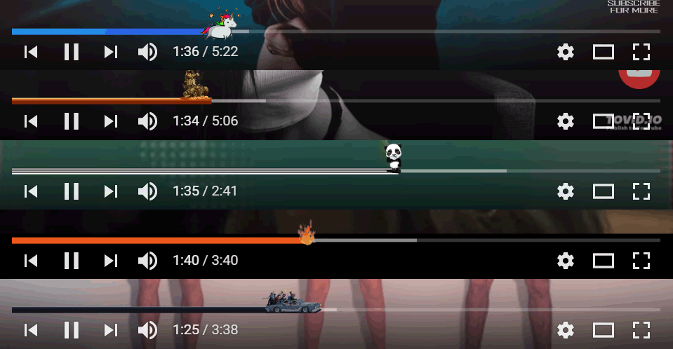
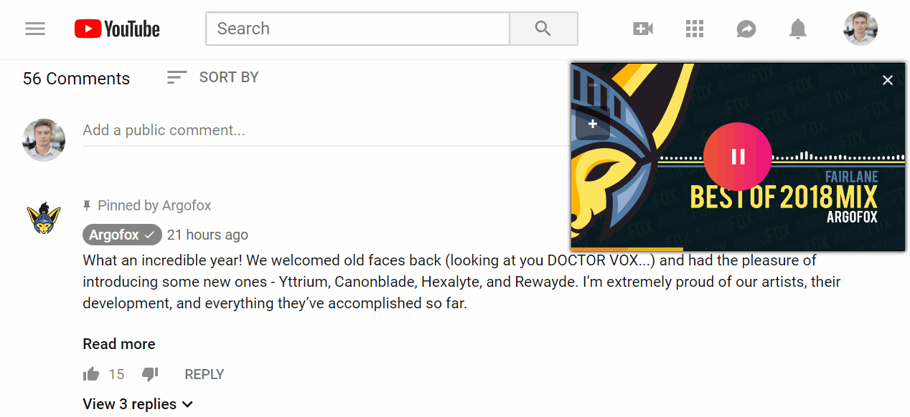

  

  
  
  
  
  
  
  

## Table of content
- [About](#about)
- [Installation](#installation)
- [Features](#features)
- [Screenshots](#screenshots)
- [Road map](#road-map)
- [Development](#development)
- [License](#license)
- [Changelog](CHANGELOG.md)

## About
_First of all please have in mind that extension name "Make YouTube™ great again" is chosen only because it sounds funny! Please don't look for any hidden political message - there is none._

Make YouTube™ Great Again is a Browser extension which extends YouTube websites user interface with additional [features](#features). User don't have to use all of the extensions features as there is an option to toggle each of them on and off. There is also a history tab which shows how many times and on what YouTube™ videos those features been used.

## Installation
Chrome & Vivaldi users please click below:

Firefox users please head to link below:

## Features

  <strong>Loop videos</strong>
  

  
  

Adds button under each YouTube™ video which when activated enables video looping.
This works fine with both new HTML5 player and legacy flash player.

____

  <strong>Preview like stats on video thumbnails</strong>
  

  
  

Allows user to see how many times video was liked/disliked before getting to actual video clip page.
Once user hovers video thumbnail it adds a like/dislike indicator.

____

  <strong>Hide comments</strong>
  

  
  

Sometimes it's nice to hide the comments... This feature does exactly that.
It hides both normal comments and live chat messages.

____

  <strong>Custom progress bar</strong>
  

  
  

Have a custom and nice looking playback progress bar!

____

  <strong>Floating video</strong>
  

  
  

Don't miss a second of your YouTube™ video even when reading comments!

## Screenshots

## Road map
* Port extension to browsers such as Firefox and Opera
* Add more features

## Development
Everyone is welcomed to contribute to the project or use the code for their own projects

To contribute you need to perform these steps:
1. Run `npm install` to install npm dependencies
2. Apply your changes and modifications
3. Run `npm run lint` to make sure code is well formatted
4. Run `npm run build:chrome` to compile the code and generate extension source folder
5. In your browser extensions window enable development mode and load MYGA extension from folder `extension` to test your changes

## License
The repository code is open-sourced software licensed under the [MIT license](https://github.com/SlimDogs/make-youtube-great-again/blob/master/LICENSE?raw=true).