

  

  
  
  
  
  

<strong><a href="https://tautvydasderzinskas.github.io/make-youtube-great-again/">Website</a></strong> · <a href="https://addons.mozilla.org/en-GB/firefox/addon/myga/">Firefox Add-ons</a> · <a href="https://chromewebstore.google.com/detail/geonnhfmhfjfkbbkjmbanmjommkjlnim">Chrome Web Store</a> · <a href="https://microsoftedge.microsoft.com/addons/detail/ocfefmgnhjaediojkdkjagglhlnedclj">Edge Add-ons</a> · <a href="https://github.com/TautvydasDerzinskas/make-youtube-great-again/releases/latest">Latest release</a>

## About
_First of all please have in mind that extension name "Make YouTube™ great again" is chosen only because it sounds funny! Please don't look for any hidden political message - there is none._

Make YouTube™ Great Again is a browser extension adding the small things YouTube™ is missing. Every feature can be switched on or off in the extension's popup, so you only keep what you use. Everything it saves stays in your browser: no accounts, no analytics, no tracking.

## Installation
Chrome, Opera & Vivaldi users please install it from the [Chrome Web Store](https://chromewebstore.google.com/detail/geonnhfmhfjfkbbkjmbanmjommkjlnim).

Edge users please install it from [Microsoft Edge Add-ons](https://microsoftedge.microsoft.com/addons/detail/ocfefmgnhjaediojkdkjagglhlnedclj).

Or install it manually (it won't update on its own):

1. Download `myga-chrome.zip` from the [latest release](https://github.com/TautvydasDerzinskas/make-youtube-great-again/releases/latest) and unzip it
2. Open `chrome://extensions` (Edge: `edge://extensions`) and switch on **Developer mode**
3. Click **Load unpacked** and select the unzipped folder

Firefox users please head to link below:

## Features

### Audio mode
Listening to music, a podcast or a talk? Mark a video as audio and it plays at the lowest video quality behind its artwork, saving bandwidth with the same sound quality. Marked videos play as audio every time they load, and a playlist can be marked in one click.

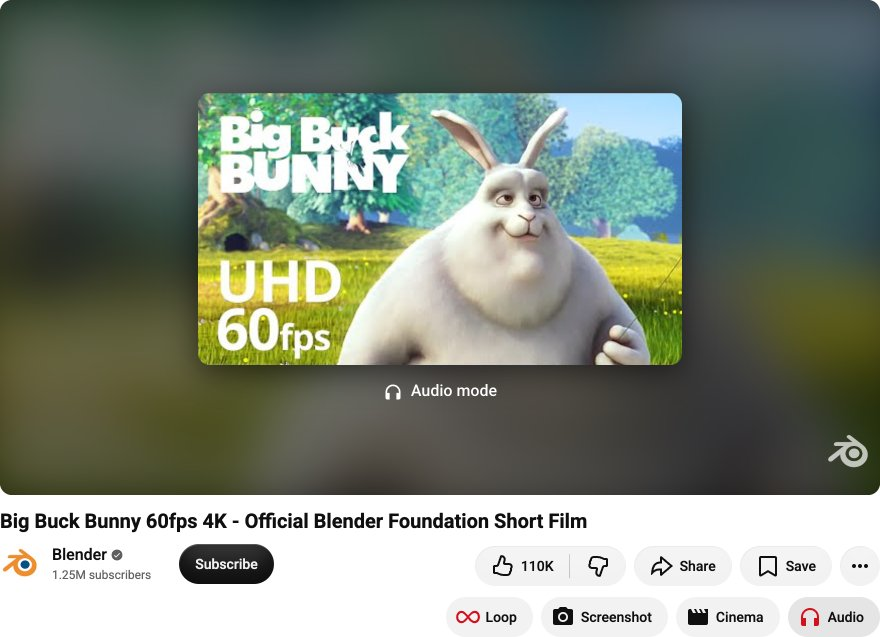

### Cinema mode
Fades out everything around the video. Press Esc or click around the video to bring the page back.

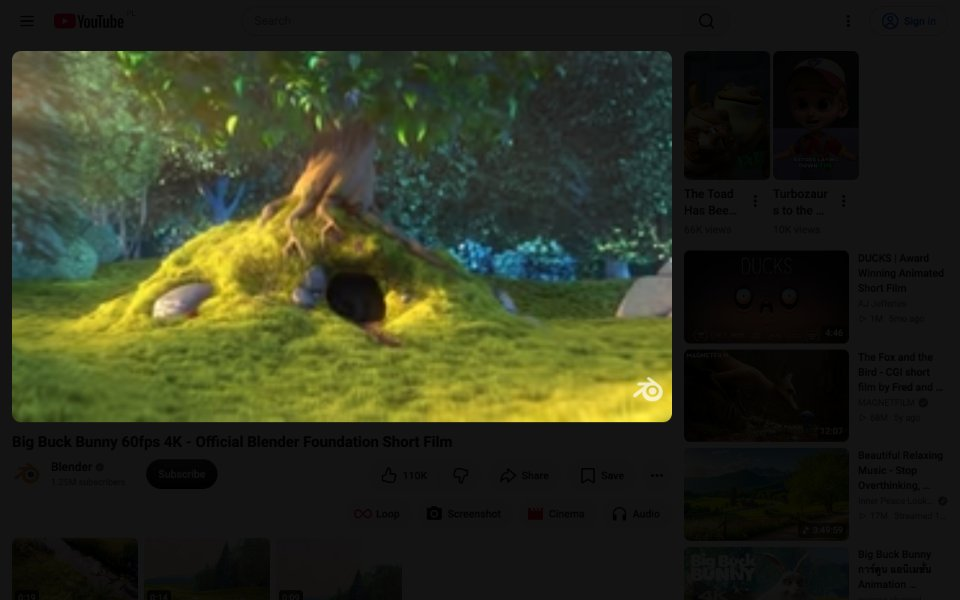

### Loop
Plays the video on repeat.

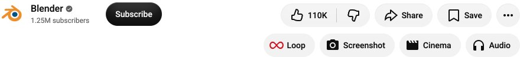

### Screenshots
Saves the current frame in one click, in the quality you're watching. Screenshots show under the video and in the popup, ready to download or delete, and take you back to the moment they were taken.

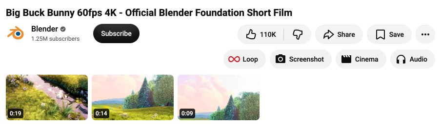

### Comment drafts
Adds "Create a Draft" to the comment box. Drafts show above the comments, ready to publish, edit or delete, and are all listed in the popup.

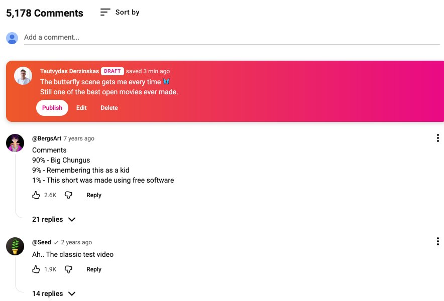

### Channel blacklist
Hides videos of channels you don't want to see, everywhere on YouTube™: home feed, search, the sidebar, playlists. Blacklist a channel with the Blacklist button under a video, or while hovering any video in a list, after confirming. The popup lists blacklisted channels, ready to remove.

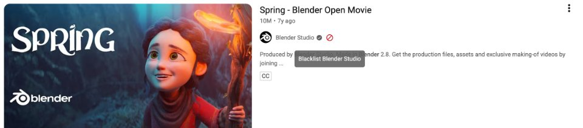

### Floating video
Keeps the video playing in a small window while you scroll down to read the comments. Move it anywhere and resize it.

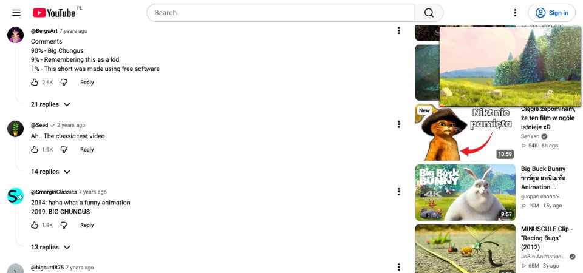

### Custom progress bar
Swaps the progress bar for a playful one: Nyan Cat, a unicorn, a panda and more.

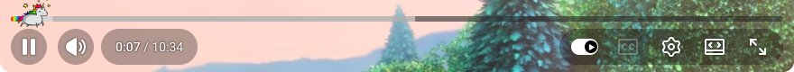

### Hide comments
Hides comments and live chat messages.

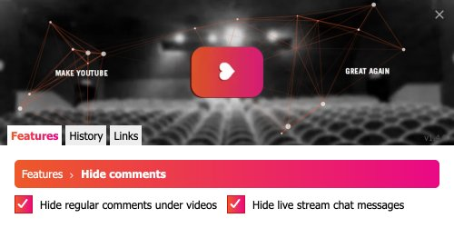

### Hide the Thanks button
Removes the "Thanks" button from under videos.

### History
Lists the videos you've recently watched and looped.

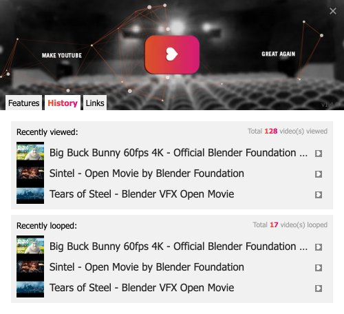

## Screenshots
<a href="docs/images/screenshot_01.jpg" target="_blank">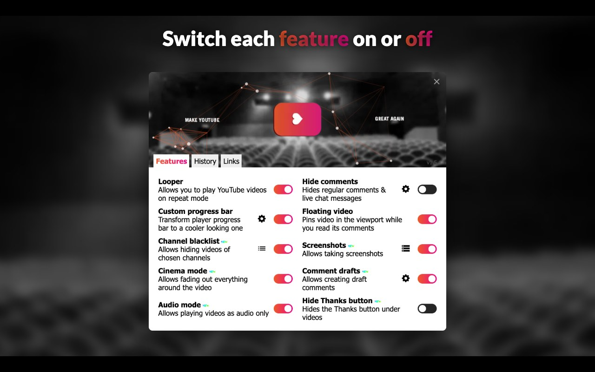</a><a href="docs/images/screenshot_02.jpg" target="_blank">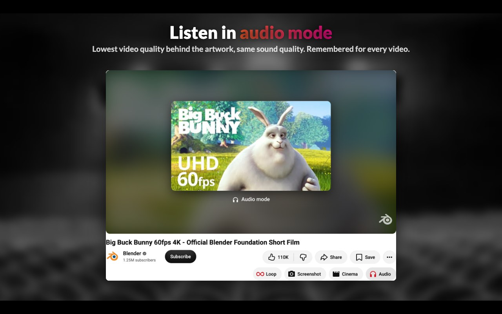</a><a href="docs/images/screenshot_03.jpg" target="_blank">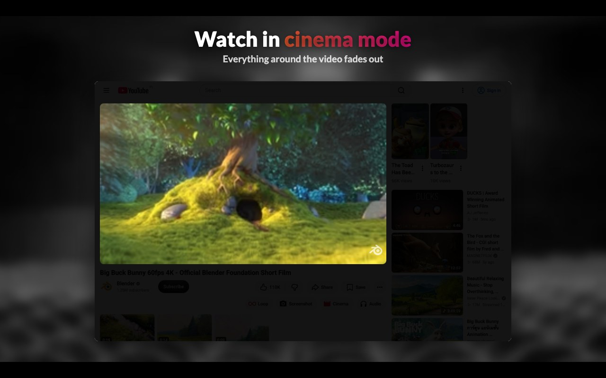</a><a href="docs/images/screenshot_04.jpg" target="_blank">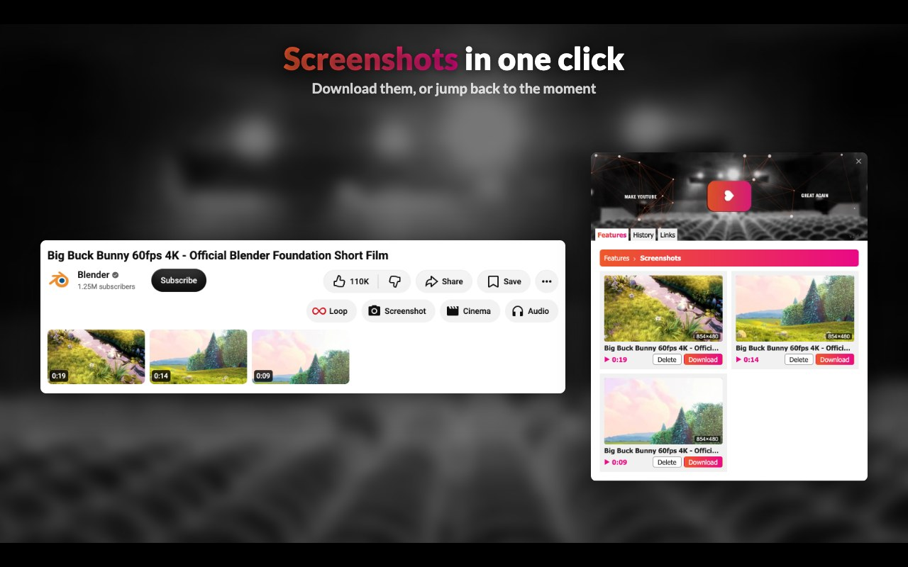</a><a href="docs/images/screenshot_05.jpg" target="_blank">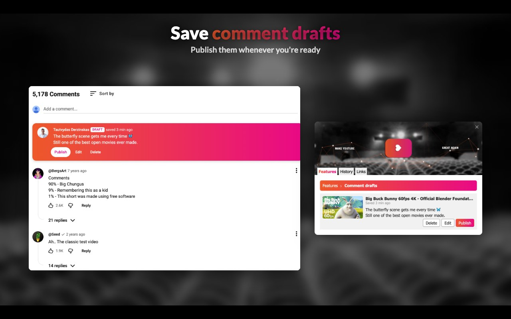</a><a href="docs/images/screenshot_06.jpg" target="_blank">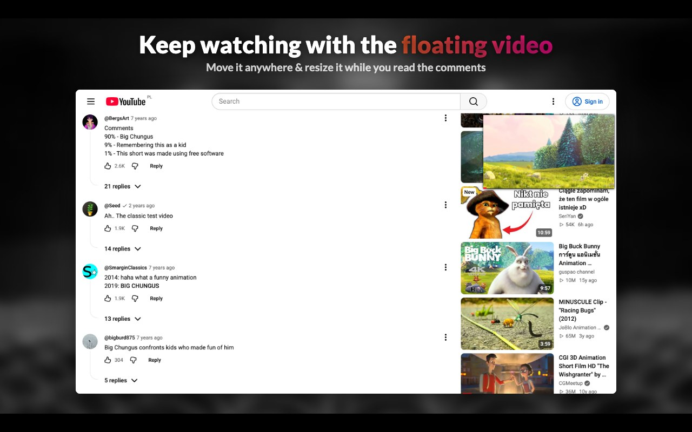</a><a href="docs/images/screenshot_07.jpg" target="_blank">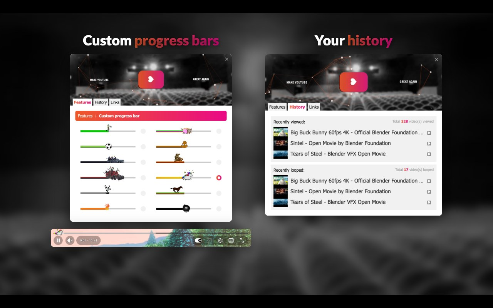</a><a href="docs/images/screenshot_08.jpg" target="_blank">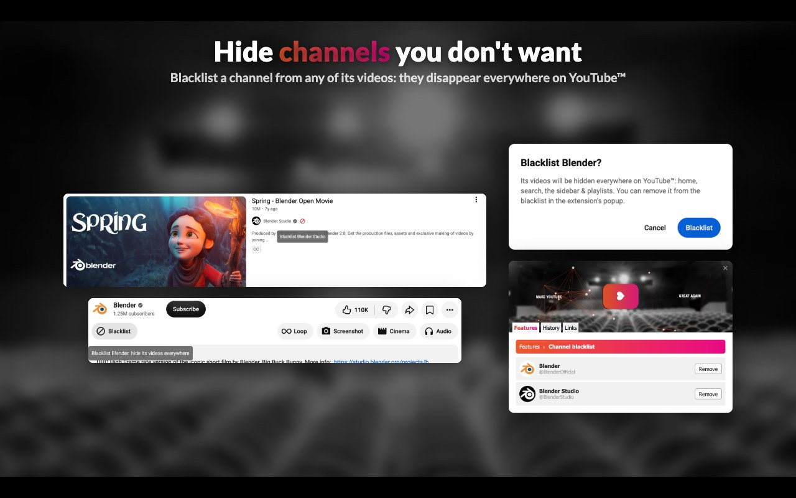</a>

## Contributing
Want to help? See [CONTRIBUTING.md](CONTRIBUTING.md), which also has the [build instructions for add-on reviewers](CONTRIBUTING.md#build-instructions-for-add-on-reviewers). Changes are listed in the [changelog](CHANGELOG.md).

## Support
If Make YouTube™ Great Again is useful to you, consider supporting its development:

- [GitHub Sponsors](https://github.com/sponsors/TautvydasDerzinskas)
- [Buy Me a Coffee](https://buymeacoffee.com/TautvydasDerzinskas)

## License
The repository code is open-sourced software licensed under the [MIT license](LICENSE).