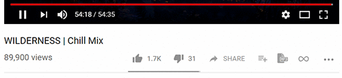
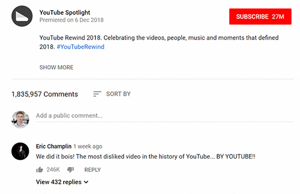
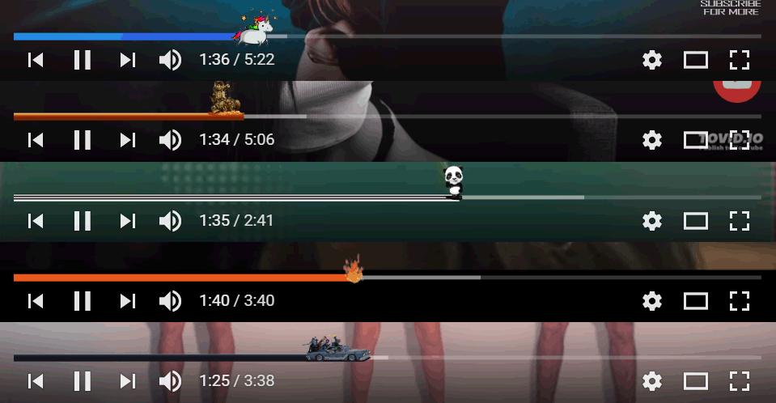
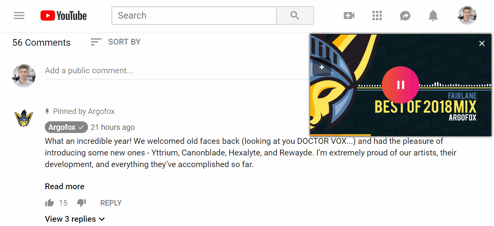

<p align="center">
  <a href="https://github.com/TautvydasDerzinskas/make-youtube-great-again"></a>
</p>

<p align="center">
  <a href="https://github.com/TautvydasDerzinskas/make-youtube-great-again/actions/workflows/ci.yml" target="_blank"></a>
  <a href="http://commitizen.github.io/cz-cli" target="_blank"></a>
  <a href="https://github.com/semantic-release/semantic-release" target="_blank"></a>
  <a href="https://opensource.org/licenses/MIT" target="_blank"></a>
</p>

## Table of content
- [About](#about)
- [Installation](#installation)
- [Features](#features)
- [Screenshots](#screenshots)
- [Development](#development)
- [Releasing](#releasing)
- [License](#license)
- [Changelog](CHANGELOG.md)

## About
_First of all please have in mind that extension name "Make YouTube™ great again" is chosen only because it sounds funny! Please don't look for any hidden political message - there is none._

Make YouTube™ Great Again is a Browser extension which extends YouTube websites user interface with additional [features](#features). User don't have to use all of the extensions features as there is an option to toggle each of them on and off. There is also a history tab which shows how many times and on what YouTube™ videos those features been used.

## Installation
Chrome, Edge, Opera & Vivaldi users (the extension is not in the Chrome Web Store at the moment):

1. Download `myga-chrome.zip` from the [latest release](https://github.com/TautvydasDerzinskas/make-youtube-great-again/releases/latest) and unzip it
2. Open `chrome://extensions` and switch on **Developer mode**
3. Click **Load unpacked** and select the unzipped folder

Firefox users please head to link below:

<a href="https://addons.mozilla.org/en-GB/firefox/addon/myga/" target="_blank">
  
</a>

## Features

<p align="center">
  <strong>Loop videos</strong>
  <p align="center">
  
  </p>
</p>
Adds button under each YouTube™ video which when activated enables video looping.
This works with the HTML5 player.

____

<p align="center">
  <strong>Hide comments</strong>
  <p align="center">
  
  </p>
</p>
Sometimes it's nice to hide the comments... This feature does exactly that.
It hides both normal comments and live chat messages.

____

<p align="center">
  <strong>Custom progress bar</strong>
  <p align="center">
  
  </p>
</p>
Have a custom and nice looking playback progress bar!

____

<p align="center">
  <strong>Floating video</strong>
  <p align="center">
  
  </p>
</p>
Don't miss a second of your YouTube™ video even when reading comments!

## Screenshots
<a href="docs/images/screenshot_01.jpg" target="_blank"></a><a href="docs/images/screenshot_02.jpg" target="_blank"></a><a href="docs/images/screenshot_03.jpg" target="_blank"></a><a href="docs/images/screenshot_04.jpg" target="_blank"></a><a href="docs/images/screenshot_05.jpg" target="_blank"></a>


## Development
Everyone is welcomed to contribute to the project or use the code for their own projects.

Requirements: Node.js 24 (see `.nvmrc`).

1. Run `npm install` to install dependencies (this also sets up the git hooks)
2. Run `npm run dev` (Chrome) or `npm run dev:firefox` to build in watch mode into `dist/<browser>`
3. Load the extension:
   - **Chrome**: open `chrome://extensions`, enable developer mode and "Load unpacked" the `dist/chrome` folder
   - **Firefox**: open `about:debugging#/runtime/this-firefox` and "Load Temporary Add-on…" selecting `dist/firefox/manifest.json`

| Script | Description |
| --- | --- |
| `npm run build` | Production build for both browsers (`dist/chrome`, `dist/firefox`) |
| `npm run build:chrome` / `npm run build:firefox` | Production build for a single browser |
| `npm run zip` | Package the builds into `myga-chrome.zip` & `myga-firefox.zip` |
| `npm run lint` | Lint with [oxlint](https://oxc.rs/docs/guide/usage/linter) |
| `npm run typecheck` | Type check with TypeScript |
| `npm run commit` | Write a conventional commit message interactively |

### Build instructions for add-on reviewers
The extension is written in TypeScript and bundled with [Rspack](https://rspack.rs). To reproduce the submitted Firefox build from source:

```sh
npm ci
npm run build:firefox
```

The output is written to `dist/firefox`.

## Releasing
Releases are fully automated with [semantic-release](https://github.com/semantic-release/semantic-release). Commit messages must follow [Conventional Commits](https://www.conventionalcommits.org) (enforced by commitlint): `fix:` → patch, `feat:` → minor, `feat!:` / `BREAKING CHANGE:` → major.

Every push to `master` runs the [Release workflow](.github/workflows/release.yml), which:
1. runs the CI checks (lint, typecheck, build)
2. works out the next version from the commits since the last release and updates `package.json` & `CHANGELOG.md`
3. builds both browsers with that version and publishes the Firefox add-on to addons.mozilla.org
4. creates a GitHub release with both zips attached (the Chrome zip is installed from there, the extension is not in the Chrome Web Store at the moment)

The following repository secrets are required (in the `release` environment):

| Secret | Description |
| --- | --- |
| `AMO_API_KEY`, `AMO_API_SECRET` | addons.mozilla.org API key (JWT issuer) & secret ([developer hub](https://addons.mozilla.org/developers/addon/api/key/)) |

## License
The repository code is open-sourced software licensed under the [MIT license](LICENSE).